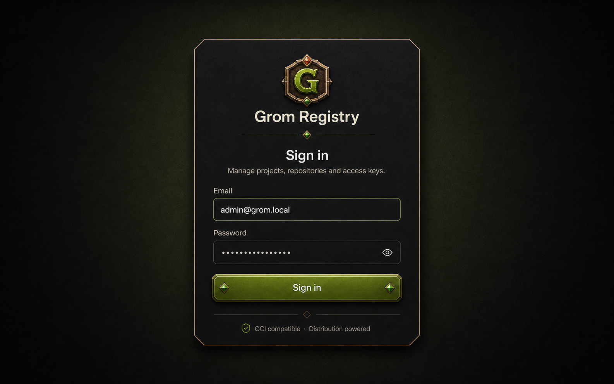
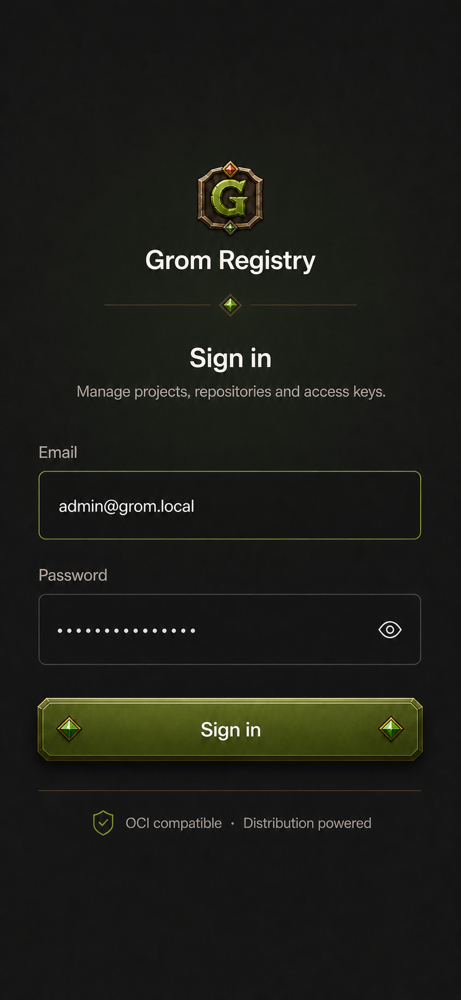

# Grom visual identity

This document defines the approved visual direction for the Grom web application.
It is a design reference rather than a pixel-perfect implementation specification.

## Product story

Grom is an orc who protects the records and important artifacts kept by a temple.
That story gives the product personality, but it must not turn the management UI
into a game interface.

The intended balance is approximately:

- **85% modern web product:** clear hierarchy, conventional controls, efficient
  tables and forms, responsive behavior, and accessible interaction states.
- **15% RPG craft:** compact crests, faceted crystals, shallow relief, clipped
  corners, antique-bronze lines, and warm fantasy-inspired colors.

Product terminology remains literal. Use `Projects`, `Repositories`, `Service
accounts`, `Access keys`, and other domain terms in navigation and actions.
Fantasy language may support descriptions and empty states, but must not obscure
what an operation does.

## Approved sign-in direction

The sign-in screen is the first reference implementation for the visual system.

### Desktop

The desktop layout uses one centered, narrow surface. The card has a restrained
bronze hairline and clipped corners. The background is calm and abstract; it must
not depict a temple, dungeon, archive, or other game-like environment.
The crystals shown inside the concept button are not part of the implementation;
button identity comes from relief, color, bevel, and press behavior.

### Mobile

The mobile layout removes the visible card surface and lets the form occupy the
available width. Ornament is reduced, but the crest, divider crystal, and raised
primary action remain recognizable.

## Visual principles

### Modern structure first

- Use familiar layouts and control behavior.
- Preserve generous spacing and strong information hierarchy.
- Keep data-heavy pages denser and less ornamental than brand moments.
- Do not replace generic interface icons with fantasy illustrations.
- Avoid game HUD patterns, inventory grids, quest language, or decorative frames
  around every component.

### RPG details as punctuation

- The compact Grom crest is a brand mark, not a page illustration.
- Crystals mark emphasis or brand moments; they are not general-purpose bullets.
- Relief belongs primarily to the main call to action.
- Bronze lines and clipped corners may define important surfaces.
- A page should normally use no more than one prominent ornamental treatment.

### Grom character usage

The character is part of the wider brand, but is not part of the approved
sign-in composition or application background. Future use should be limited to
special empty states, onboarding, release communication, or other isolated
illustration moments. Do not place the character persistently in the application
shell.

## Color direction

The following values are provisional implementation tokens. Adjustments are
allowed during visual QA, provided contrast and the overall relationships remain
consistent.

| Role | Suggested value | Use |
|---|---|---|
| Obsidian | `#090d0b` | Page background |
| Charcoal | `#111512` | Primary surface |
| Raised charcoal | `#171b16` | Elevated surface and hover |
| Warm ivory | `#f2ede3` | Primary text |
| Muted stone | `#aaa39a` | Secondary text |
| Orc green | `#91ad24` | Primary action and focus |
| Bright moss | `#abc936` | Hover and highlighted edge |
| Deep moss | `#40540e` | Button shadow and pressed state |
| Antique bronze | `#a97832` | Fine borders and dividers |
| Ruby | `#d15a35` | Small brand crystal and destructive emphasis |
| Emerald crystal | `#b1dd39` | Small decorative crystal highlight |
| Danger | `#db6a65` | Errors and destructive actions |

Green should feel organic rather than fluorescent. Ruby and emerald highlights
must remain small enough that they do not compete with status colors.

## Typography

- Keep a modern sans-serif for navigation, headings, controls, and body text.
- Use lowercase `grom registry` or title case `Grom Registry` according to the
  surrounding hierarchy; do not use carved fantasy lettering in the UI.
- Keep commands, image paths, tags, and digests monospaced.
- The illustrated source logo may be used in marketing artifacts, but it does
  not define application typography.

## Component language

### Primary button

The primary button is the most visible RPG-influenced component.

- Use a shallow vertical green gradient.
- Add a fine lighter top edge and a darker lower edge.
- Use a short contact shadow to create relief.
- Keep the pressed state physically believable by reducing the shadow and
  translating the surface down slightly.
- Mildly bevel or clip the corners.
- Do not place crystals inside buttons.

Secondary, ghost, and destructive buttons should remain comparatively flat.

### Crystals

- Use one crystal in a brand divider or compact brand composition.
- Keep them decorative and non-interactive unless an accessible action is
  explicitly attached.
- Do not use crystals in buttons or as status indicators, checkboxes, radio
  buttons, or table decorations.
- Prefer small optimized image assets or simple CSS/SVG geometry.

### Cards and modal surfaces

- Use dark neutral surfaces with low-contrast separation.
- Important brand surfaces may use a one-pixel bronze border and clipped corners.
- Ordinary cards, tables, and modals should use the shared modern radius and
  border tokens.
- Do not simulate wood, parchment, stone slabs, or thick metal frames.

### Inputs

- Inputs remain conventional, flat, and easy to scan.
- Use green for focus, not permanent decoration on every field.
- Maintain visible labels and clear error text.
- Do not add crystals or relief to inputs.

### Icons

- Continue using Lucide for generic interface actions.
- Product-specific crests and crystals belong under the product asset folders.
- Decorative icons must not replace semantic labels or accessible names.

## Responsive behavior

- Use a centered card at desktop widths and a borderless single column on mobile.
- Maintain at least `24px` horizontal page padding where the viewport permits.
- Interactive controls should be at least `48px` high on touch layouts.
- Keep the mobile crest near `48–56px`; it must not dominate the first viewport.
- Let the primary button span the form width.
- Avoid fixed heights; the form must tolerate validation errors, browser zoom,
  small-height devices, and the on-screen keyboard.
- Respect safe-area insets where relevant.

## Motion

- Button press may use a short vertical translation and shadow reduction.
- Crystals may receive a very restrained highlight on hover or focus.
- Do not use looping glows, particles, floating runes, or ambient game animation.
- Honor `prefers-reduced-motion`.

## Accessibility requirements

- Meet WCAG AA contrast for text, controls, focus indicators, and error states.
- Do not communicate meaning through green, ruby, or crystal shape alone.
- Decorative crystals and divider artwork should be hidden from assistive
  technology.
- Preserve visible keyboard focus.
- Test at 200% browser zoom and at a `320px` viewport width.
- Keep loading and disabled states distinguishable without relying only on
  opacity.

## Asset workflow

The files under `frontend/src/assets/raw` are visual source material. They are not
ready for direct production use because they contain white backgrounds, raster
detail, and compositions that do not scale to all interface contexts.

Before implementation:

1. Produce a simplified compact crest for small application sizes.
2. Produce optimized crystal assets or code-native equivalents.
3. Create transparent and size-appropriate exports.
4. Place approved brand assets under `frontend/src/assets/logos`.
5. Place product-specific decorative assets under `frontend/src/assets/icons`.
6. Keep concept mockups under `docs/assets/visual-identity`; do not ship them in
   the frontend bundle.

## Implementation sequence

1. Define semantic color, border, shadow, and radius tokens.
2. Prepare the compact crest and crystal assets.
3. Implement the raised primary button and its interaction states.
4. Rebuild the sign-in screen for desktop and mobile.
5. Apply the quieter parts of the system to the application shell.
6. Propagate tokens to cards, tables, modals, badges, and empty states.
7. Verify accessibility, responsive behavior, and reduced motion.

## Acceptance checklist

- The screen reads as a modern registry product before it reads as RPG-inspired.
- No persistent character or illustrated fantasy environment is present.
- The main action has controlled relief and remains accessible.
- Buttons contain no crystals and move down without layout reflow when pressed.
- Crystals are sparse, small, and do not encode required information.
- Mobile is a deliberate composition rather than a scaled desktop card.
- Technical content remains highly legible.
- The visual treatment is feasible with Vue, CSS, and small optimized assets.

## Documentation impact

This direction changes frontend presentation only. It does not change domain
types, ownership, routes, repositories, or the OpenAPI contract, so
`docs/domain-model.md` and `docs/architecture-and-mvp.md` require no update.

See `docs/visual-implementation-plan.md` for the detailed delivery plan.
